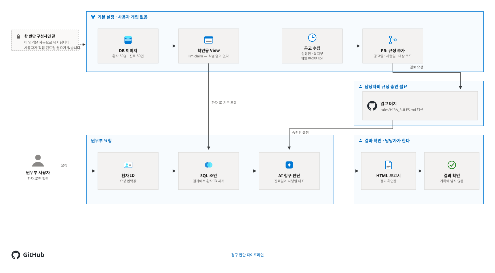

# HIRA Billing Copilot

심평원 규정은 매일 바뀌고, 공고일과 시행일이 다릅니다. 그래서 같은 수가코드라도
진료일에 따라 청구할 수 있기도 하고 없기도 합니다. 이 대조를 사람이 매번 하는 대신
GitHub 위로 옮긴 템플릿입니다.

규정은 아침마다 모여 PR로 올라오고, 원무 담당자가 머지한 규정만 판단에 쓰입니다.
AI는 데이터베이스에 접속하지 않습니다 — 조회는 워크플로가 끝내고, 그 결과에서 환자
번호를 뺀 뒤에 넘깁니다. 판단 결과는 저장소에 남지 않습니다.

## 파이프라인



| 단계 | 워크플로 | 트리거 | 산출물 |
|---|---|---|---|
| 규정 수집 | `hira-rule-sync.md` | 매일 크론 · 수동 | `rules/HIRA_RULES.md` PR |
| 요청과 조회 | `billing-intake.yml` | Actions 폼 | 비식별 진료행 |
| 판단과 보고서 | `billing-review.md` | 조회가 끝나면 | Artifact `billing-report` |
| 기록 만료 | `sweep-runs.yml` | 30분마다 | 지난 요청 실행 삭제 |

Actions 탭에는 순서대로 번호가 붙어 보입니다 — `0. 규정 수집` · `1. 진료비 확인 요청` ·
`2. 진료비 청구 판단` · `9. 요청 기록 지우기`.

사람이 손대는 곳은 두 군데뿐입니다 — **규정을 머지할 때**와 **판단 결과를 읽을 때**.
수집은 PR을 만들 뿐 스스로 머지하지 않습니다. 머지하지 않은 규정은 판단에 쓰이지 않습니다.

### 규정 수집

새벽마다 심평원·복지부 공고를 훑어 **청구에 닿는 변경만** 골라 `rules/HIRA_RULES.md`에
추가합니다. 기존 항목은 지우지 않습니다 — 2025-12-30 진료분은 그때의 규정으로 판단해야
하기 때문입니다.

공고를 받아오는 일은 파이썬이 하고, 무엇이 우리 청구에 닿는지 고르는 판단만 AI가 합니다.
상대가 정부 사이트라 느린 날이 있어 수집에 5분 한도를 두었고, 다 못 읽었으면 PR에
"몇 건만 확인했다"고 적습니다. 못 읽은 것과 없는 것은 다릅니다.

### 요청과 조회

Actions 에서 **1. 진료비 확인 요청** 을 열고 환자 ID를 넣으면 워크플로가 그 번호로
조회합니다. 조인은 `llm.claim` 뷰가 이미 해 두었고, 결과에서 환자 번호 한 열만 빼서
넘깁니다. 열을 손으로 나열하지 않아 뷰에 열이 늘어도 빠뜨려 새지 않습니다.
**환자 번호는 이 단계에서 끝납니다.**

### 판단과 보고서

진료건마다 **급여 인정 / 조건부 / 불인정**을 가릅니다. 먼저 보는 것은 진료일과 시행일이고,
금액은 본인부담률과 맞는지 검산하되 **고쳐 쓰지 않고 어긋났다고 보고합니다.**

결과는 이슈에도 PR에도 커밋에도 게시되지 않습니다. 실행 Artifact `billing-report` 로만
내려받는 **기록에 남지 않는 결과 확인**입니다.

## 데이터 보호

AI가 보는 것은 `llm.claim` 뷰 하나입니다. 이름·생년월일·연락처·주민번호토큰은 가려진 것이
아니라 **뷰에 열 자체가 없습니다.** 나이는 진료일 기준으로 계산되어 들어갑니다.

환자 번호는 조회 키라서 뷰에 남기되, 뷰를 읽는 역할에게는 **그 열만 빼고** 권한을 줍니다.
그래서 `SELECT *` 조차 권한 오류가 납니다. 이 경계는 컨테이너가 뜰 때 게이트가 확인하므로,
경계가 열린 채로는 데이터베이스가 준비되지 않습니다.

요청과 판단은 저장소에 남지 않습니다. 환자 번호가 닿는 곳은 요청 실행의 입력값 한 곳뿐이고,
`sweep-runs`가 30분마다 지난 실행을 지웁니다. 자세한 것은 [실습 안내](instructions.md)에
표로 적어 두었습니다.

## 시작하기

실습으로 처음 돌려보신다면 [instructions.md](instructions.md)를 따라가세요.

이 저장소를 템플릿으로 새 저장소를 만든 뒤, 설정 두 가지만 하면 됩니다.

1. Settings → Secrets and variables → Actions → **New repository secret**
   이름 `LLM_DB_PASSWORD`, 값은 아무 문자열
2. Settings → Actions → General → **Allow GitHub Actions to create and approve pull requests**
   (규정 수집 PR에 필요합니다)

데이터베이스는 원본 저장소가 올려 둔 **공개 이미지**를 자격증명 없이 받아 씁니다.
복사본이 이미지를 만들 필요가 없고, 주소에 각자의 계정 이름이 들어가지도 않습니다 —
대문자가 섞인 계정에서는 도커가 그런 주소를 거부하기 때문입니다.

읽기 역할(`llm_reader`)의 비밀번호는 **이미지에 들어 있지 않습니다.** 공개 이미지에 박아
두면 그 값이 그대로 공개됩니다. 컨테이너가 뜰 때 1번의 시크릿으로 만들어집니다.

### 진료비 확인 요청하기

Actions → **1. 진료비 확인 요청** → **Run workflow** 에 환자 ID를 넣습니다.
진료일과 모델도 그 자리에서 고릅니다. 결과는 **2. 진료비 청구 판단** 실행의
**Artifacts → `billing-report`** 에서 내려받습니다.

판단에 쓸 모델은 **무료 요금제면 `auto`, 유료 Copilot 이면 `haiku`** 를 고르세요.

### 로컬에서 확인

```bash
export LLM_DB_PASSWORD=아무-문자열
docker compose up -d
./db/test-access.sh --compose              # 경계가 서 있는지 확인
python3 tools/render_report.py --check     # 보고서 변환기 자체 점검
```

## 구성

```text
.
├── .github/workflows/
│   ├── shared/billing-db.md          # DB 서비스 · 비식별 뷰 조회 도구 (공용)
│   ├── hira-rule-sync.md             # 매일 아침 규정 수집
│   ├── billing-intake.yml            # 조회 후 식별정보 제거 → 판단 호출
│   ├── billing-review.md             # 받은 진료행으로 판단 → 보고서
│   ├── publish-db-image.yml          # DB 이미지 게시 (원본 저장소에서만)
│   └── sweep-runs.yml                # 지난 요청 실행 만료 (30분 / 7일)
├── db/                               # 이미지 · init.sql · 역할 스크립트 · 합성 데이터
├── rules/HIRA_RULES.md               # 규정 Knowledge Base (시행일 추적)
├── tools/
│   ├── fetch_notices.py              # 심평원·복지부 공고 수집
│   └── render_report.py              # AI 판단 → 결과 확인용 HTML 보고서
└── site/pipeline.svg                 # 리드미의 파이프라인 그림
```

`.lock.yml` 파일은 `gh aw compile`이 생성합니다. 직접 수정하지 말고 `.md`를 고친 뒤
다시 컴파일하세요.

데이터는 전부 합성이고 수가코드와 규정만 실제입니다. 실제 병원 데이터를 넣는다면
DB 비밀번호를 시크릿으로 옮기고 포트를 열지 마세요.

모든 판단은 청구 전 원무 담당자의 확인이 필요합니다.
